<h1 align="center">💻 AR8 Processor 💻</h1>

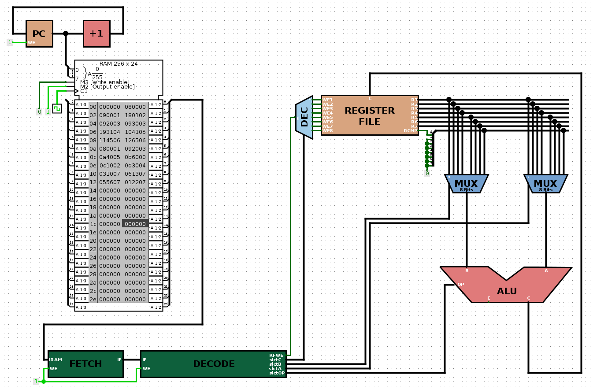

## Introduction

**AR8 Processor** is an 8-bit micro-processor built with the Logisim Evolution application, implementing the different components a real processor has in order to execute 24-bit binary instructions coming from RAM. The processor circuit combines a `PC` (Program Counter) that chooses the address of the next instruction from RAM, a `FETCH` unit that stores the instruction that will be executed, an `INSTRUCTION DECODE` unit that decodes the 24-bit instruction and changes the selection bits of the circuit to execute it, a `REGISTER FILE` that contains 7 registers of 8 bits (R1 to R7) and 1 of 1 bit for the comparison values (RCMP) that contain the different stored values, and finally an `ALU` that executes logical, arithmetic, comparison, offset, and rotation operations.

## Prerequisites

- **Logisim-evolution** to open and run the circuit.
- **Python 3** to compile the assembly file into a bytecode file.

## Installation

1. **Install Logisim-evolution using the following command :** 
```sh
sudo snap install logisim-evolution
```

2. **Install Python 3 using the following commands :** 
```sh
sudo apt update
sudo apt install python3
```

3. **Clone the repository :** 
```sh
git clone https://github.com/RayyyZen/AR8-Processor.git
```

4. **Move into the project folder :** 
```sh
cd AR8-Processor
```

5. **Write an assembly program the Files/ directory, then run the following command to compile it :** 
```sh
python3 compile_asm_ar8.py Files/input Files/output
```

6. **The output file contains the binary instructions (in hexadecimal format)** 

7. **The `AR8.circ` file contains the full processor circuit** 

8. **Launch Logisim-evolution using the following command :**
```sh
logisim-evolution
```

9. **Open the `AR8.circ` file**

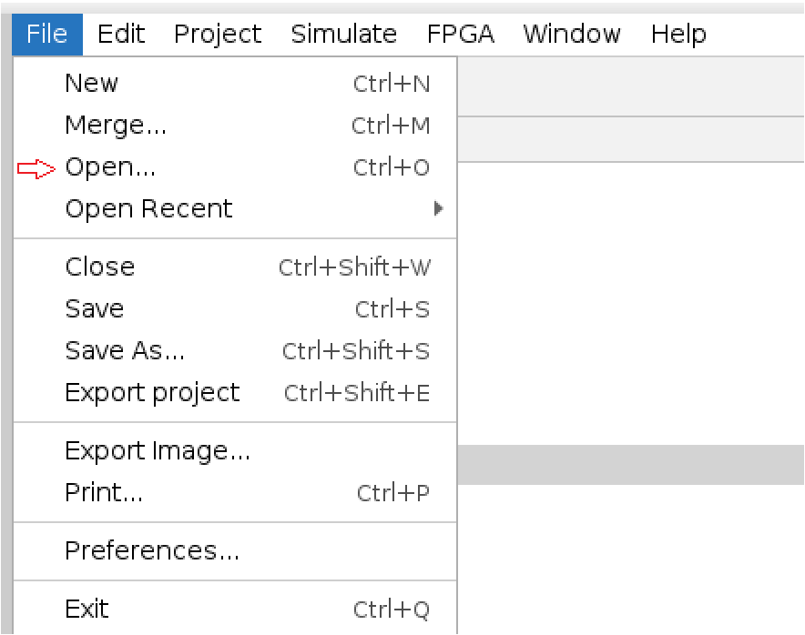

10. **Navigate to the AR8PROCESSOR module**


11. **Right-click on the RAM, select "Load Image", then load the generated output file**

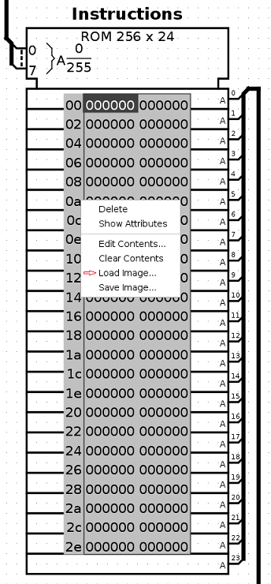

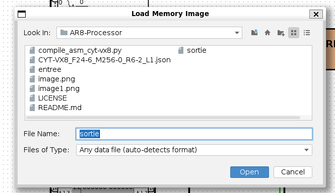

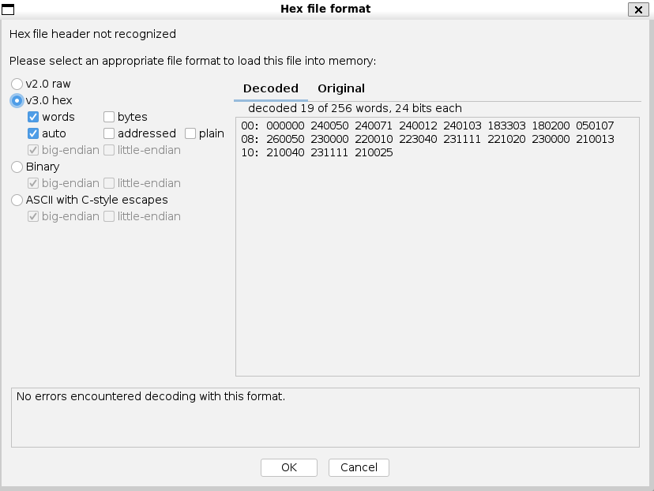

12. **Start the simulation and enable clock ticks**

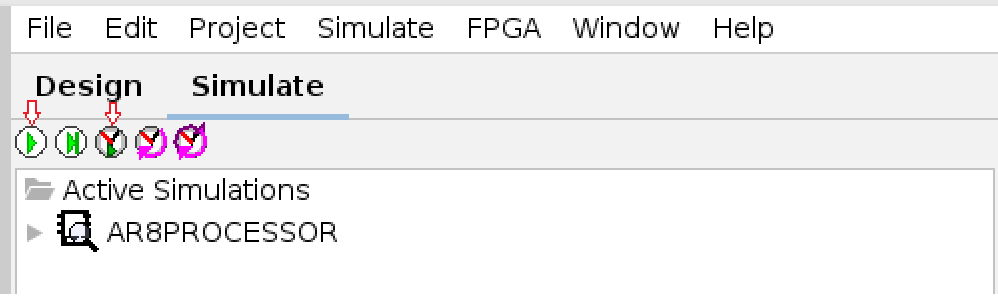

## Pipeline

The AR8 Processor follows a specific pipeline with a structured handling of each component (PC, RAM, FETCH, INSTRUCTION DECODE, DECODER, REGISTER FILE, MULTIPLEXERS, ALU) following a FETCH → DECODE → EXECUTE cycle.

### PC


The PC (Program Counter) is an 8-bit register initialized to 0. It is incremented at each clock cycle in order to point to the next instruction in RAM. It is used to select the instruction to be fetched and executed.

### RAM (code)

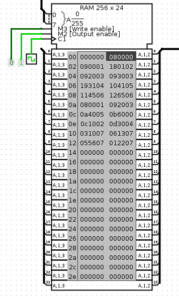

This is a RAM that stores the 24-bit instructions executed by the processor. It is separate from the data RAM (Harvard architecture) in order to simplify instruction fetching and execution flow.

### FETCH


The FETCH unit stores the next instruction to be executed, retrieved from RAM, in a 24-bit register.

### INSTRUCTION DECODE

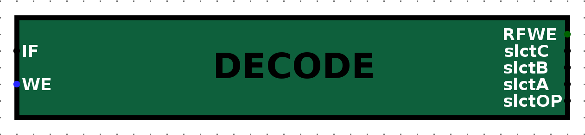

The INSTRUCTION DECODE unit stores the fetched instruction in a 24-bit register and decodes it in order to configure the control signals of each component of the circuit :

- RFWE (1 bit) : Register File Write Enable (determines whether the result is written to a register)
- slctC (3 bits) : Destination register in the Register File (where the result is stored)
- slctB (3 bits) : Source register B (second operand)
- slctA (3 bits) : Source register A (first operand)
- slctOP (6 bits) : ALU operation selector

#### Instruction format :

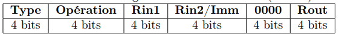

#### List of the different 24-bit instructions supported by the processor and their assembly equivalents :

##### Arithmetic :

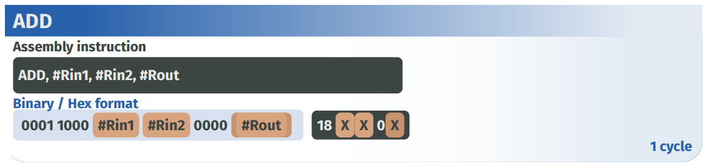

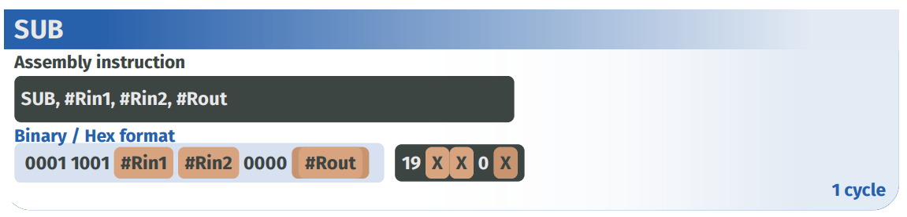

##### Logical :

###### 2 Registers :

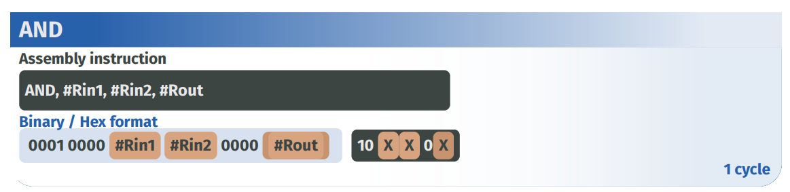

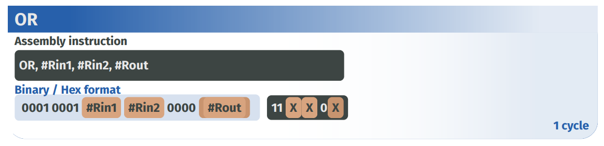

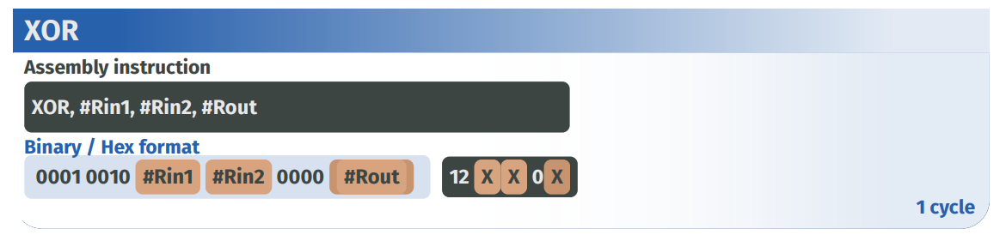

###### 1 Register :

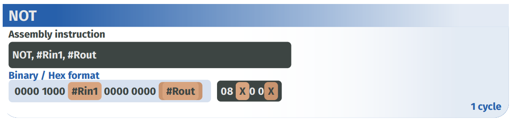

##### Offset :

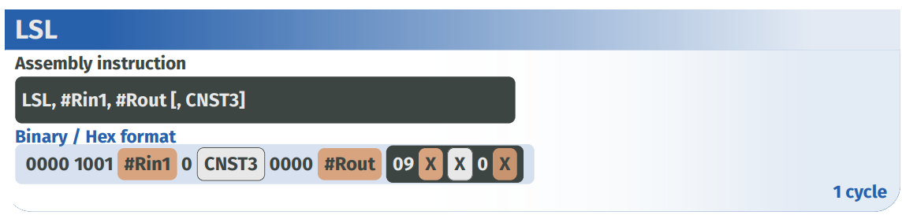

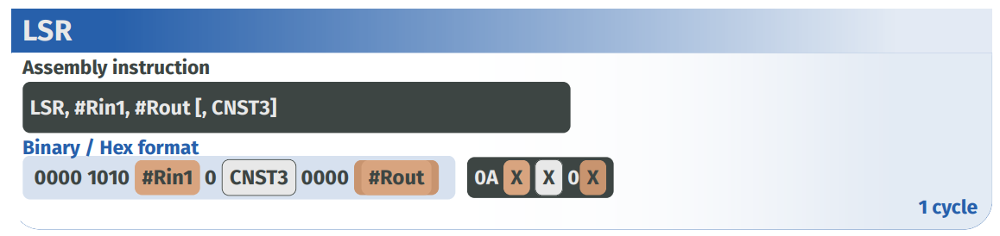


##### Rotation :

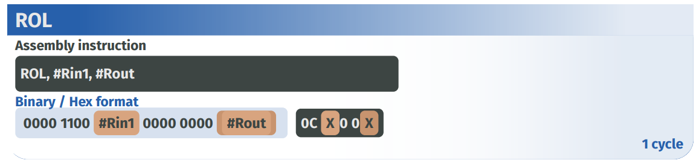

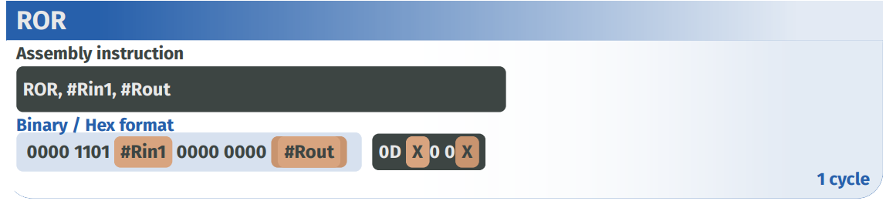

##### Comparison :

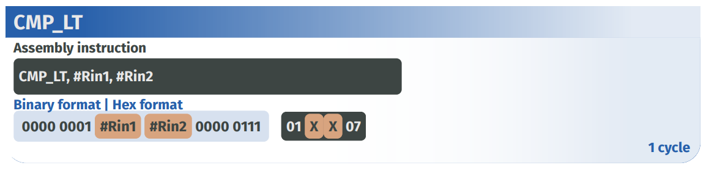

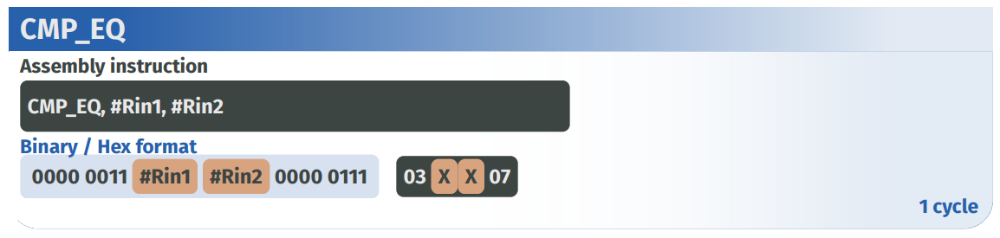


##### Others :

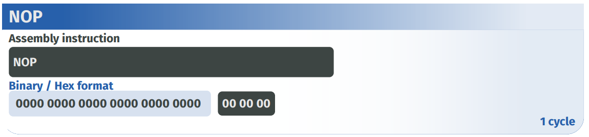

#### Example of an Assembly file : 

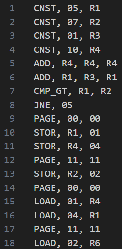

### DECODER

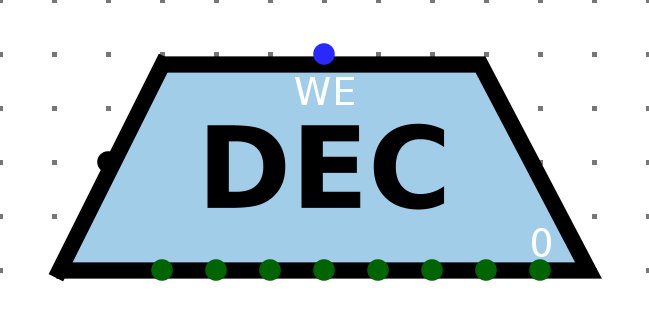

This unit selects one of the eight registers where the result will be stored by enabling its write signal while disabling all others. It is also controlled by a global write enable signal, allowing writes to be disabled when no result should be stored.

### REGISTER FILE

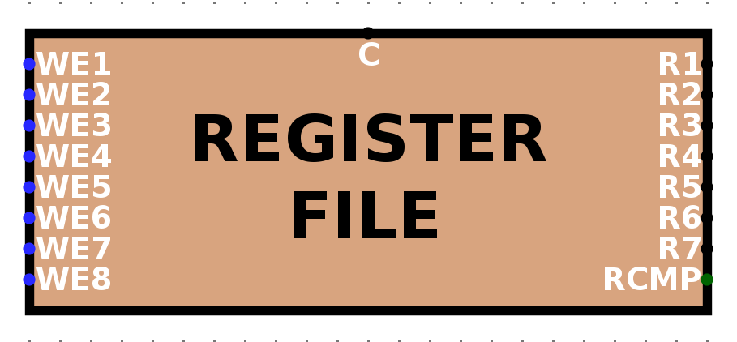

The register file contains seven 8-bit general-purpose registers (R1 to R7) used to store variables, as well as one 1-bit register (RCMP) used to store comparison results.

It is controlled by a decoder that enables writing to a single selected register. The outputs of the register file are connected to two multiplexers, which select two operands that are then processed by the ALU.

### MULTIPLEXERS


Two multiplexers are used to select operands from the register file. Based on their selection signals, they choose two registers whose values are forwarded as inputs to the ALU.

### ALU

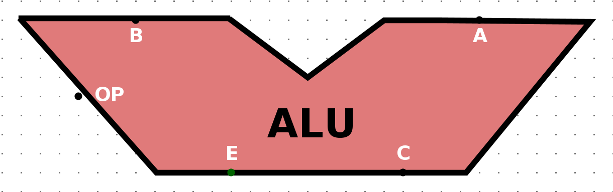

The ALU is a combinational circuit that performs all arithmetic, logical, comparison, shift, and rotation operations required by the processor. It outputs the result of the selected operation.
The operation is selected using the slctOP signal, defined as follows :

#### Arithmetic block : 
- ADD : 000000
- SUB : 000001

#### Logical block : 
- AND : 001000
- OR : 001001
- XOR : 001010

#### Offset and Rotation block : 
- NOT : 010000
- LSL : 010001
- LSR : 010010
- ASR : 010011
- ROL : 010100
- ROR : 010101

#### Comparison block : 
- INF : 011000
- EQUAL : 011001
- SUP : 011010
- DIFF : 011011

##### Note :
- The shift and rotation operations use only operand A.
- The result of comparison operations is stored as an 8-bit value, where the least significant bit represents the result.
    - Example : 1001 0101 EQUAL 1001 0101 → 0000 0001

## License

This project is licensed under the BSD 2-Clause License. See the [LICENSE](LICENSE) file for details.